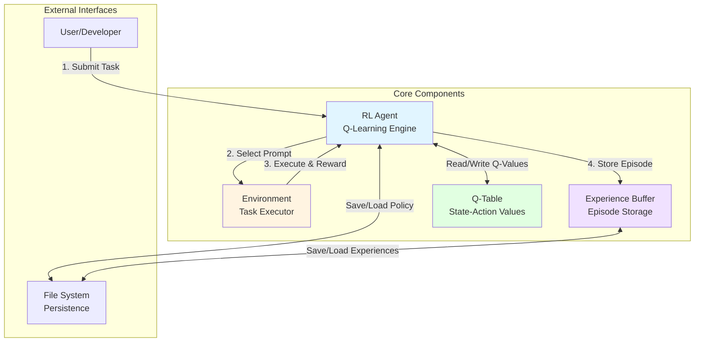
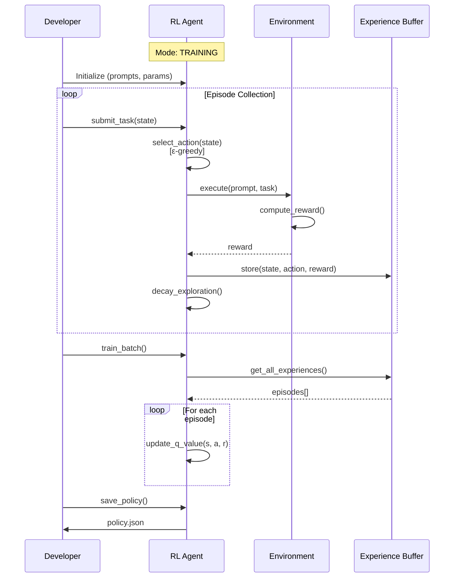
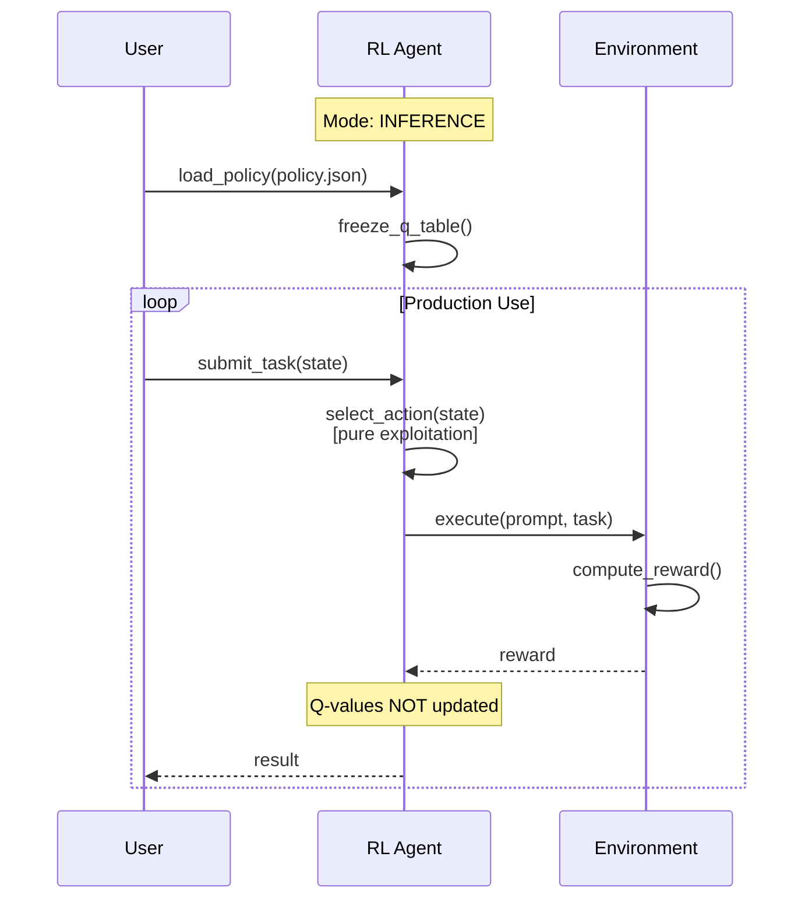
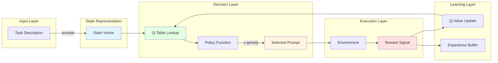

# Design Document: Prompt Selection RL Agent

## Overview

This document describes the design of a Reinforcement Learning (RL) agent that learns to select optimal prompts for given tasks. The system implements Q-learning with offline batch training, following industry-standard practices used in OpenAI's RLHF pipeline.

### Core Capabilities

- **Intelligent Prompt Selection**: Learn which prompts work best for different task contexts
- **Offline Batch Training**: Collect experiences, then train in stable batches
- **Mode Switching**: Separate training (learning) and inference (frozen policy) modes
- **Policy Persistence**: Save and load learned Q-tables across sessions
- **Experience Management**: Buffer experiences for batch training cycles
- **Extensibility**: Architecture designed to support future tool integration

### Key Design Principles

1. **Separation of Concerns**: Agent, Environment, and Experience Buffer are independent components
2. **Offline Learning**: No live updates during inference; train in controlled batches
3. **Simplicity First**: PoC focuses on core RL mechanics with clear extension points
4. **Reproducibility**: Deterministic training from saved experiences

## Architecture

### System Components

The system consists of four primary components that interact through well-defined interfaces:



### Component Responsibilities

**RL Agent**
- Selects actions (prompts) based on current state and Q-values
- Implements ε-greedy exploration strategy with decay
- Updates Q-values using Q-learning algorithm
- Manages training vs inference mode switching
- Coordinates experience collection and batch training

**Environment**
- Executes selected prompts against tasks
- Computes reward signals based on execution results
- Provides feedback to the agent
- Supports both automated and manual reward evaluation

**Experience Buffer**
- Stores completed episodes (state, action, reward tuples)
- Enables offline batch training
- Supports persistence for reproducible training runs

**Q-Table**
- Maps (state, action) pairs to expected rewards
- Initialized with zeros for unseen state-action pairs
- Updated during training, frozen during inference

### Training Workflow



### Inference Workflow



### Data Flow Architecture



## Components and Interfaces

### RL Agent Interface

```python
class RLAgent:
    """
    Core reinforcement learning agent implementing Q-learning.
    """
    
    def __init__(
        self,
        prompts: List[str],
        learning_rate: float = 0.1,
        discount_factor: float = 0.0,
        exploration_rate: float = 1.0,
        decay_rate: float = 0.995,
        min_exploration: float = 0.01
    ):
        """
        Initialize the RL agent with configuration parameters.
        
        Args:
            prompts: List of available prompt templates
            learning_rate: Q-learning alpha (0.0-1.0)
            discount_factor: Q-learning gamma (0.0-1.0)
            exploration_rate: Initial epsilon for ε-greedy (0.0-1.0)
            decay_rate: Multiplicative decay per episode (0.0-1.0)
            min_exploration: Minimum epsilon threshold
        """
        pass
    
    def select_action(self, state: str) -> str:
        """
        Select a prompt for the given state.
        
        In training mode: Uses ε-greedy (explore vs exploit)
        In inference mode: Always exploits (selects best Q-value)
        
        Args:
            state: Current task context
            
        Returns:
            Selected prompt text
        """
        pass
    
    def update(self, state: str, action: str, reward: float) -> None:
        """
        Update Q-value based on received reward (training mode only).
        
        Applies Q-learning update rule:
        Q(s,a) ← Q(s,a) + α[r + γ·max(Q(s',a')) - Q(s,a)]
        
        For single-step episodes: Q(s,a) ← Q(s,a) + α[r - Q(s,a)]
        
        Args:
            state: State where action was taken
            action: Action (prompt) that was selected
            reward: Reward received (-1.0 to 1.0)
        """
        pass
    
    def store_experience(self, state: str, action: str, reward: float) -> None:
        """
        Add episode to experience buffer for batch training.
        
        Args:
            state: State where action was taken
            action: Action (prompt) that was selected
            reward: Reward received
        """
        pass
    
    def train_batch(self) -> None:
        """
        Train on all experiences in the buffer (offline batch training).
        
        Iterates through all stored episodes and updates Q-values.
        Does not clear the buffer automatically.
        """
        pass
    
    def clear_buffer(self) -> None:
        """Clear all experiences from the buffer."""
        pass
    
    def set_mode(self, mode: str) -> None:
        """
        Switch between training and inference modes.
        
        Args:
            mode: Either "training" or "inference"
        """
        pass
    
    def save_policy(self, filepath: str) -> None:
        """
        Serialize Q-table and agent state to file.
        
        Args:
            filepath: Path to save policy JSON
        """
        pass
    
    def load_policy(self, filepath: str) -> None:
        """
        Deserialize Q-table and agent state from file.
        
        Args:
            filepath: Path to policy JSON file
        """
        pass
    
    def get_metrics(self) -> Dict[str, Any]:
        """
        Return current performance metrics.
        
        Returns:
            Dictionary containing:
            - episode_count: Total episodes completed
            - cumulative_reward: Sum of all rewards
            - average_reward: Mean reward per episode
            - exploration_rate: Current epsilon value
            - prompt_selection_counts: Dict of prompt usage
        """
        pass
```

### Environment Interface

```python
class Environment:
    """
    Environment for executing prompts and computing rewards.
    """
    
    def execute(self, prompt: str, task: str) -> float:
        """
        Execute a prompt against a task and return reward.
        
        Args:
            prompt: The selected prompt template
            task: The task description
            
        Returns:
            Reward value between -1.0 and 1.0
        """
        pass
    
    def set_manual_mode(self, enabled: bool) -> None:
        """
        Enable/disable manual reward entry.
        
        Args:
            enabled: If True, prompts user for reward input
        """
        pass
```

### Experience Buffer Interface

```python
class ExperienceBuffer:
    """
    Storage for episodes used in offline batch training.
    """
    
    def add(self, state: str, action: str, reward: float) -> None:
        """
        Add an episode to the buffer.
        
        Args:
            state: State where action was taken
            action: Action (prompt) selected
            reward: Reward received
        """
        pass
    
    def get_all(self) -> List[Tuple[str, str, float]]:
        """
        Retrieve all stored episodes.
        
        Returns:
            List of (state, action, reward) tuples
        """
        pass
    
    def clear(self) -> None:
        """Remove all episodes from buffer."""
        pass
    
    def save(self, filepath: str) -> None:
        """
        Serialize buffer to file.
        
        Args:
            filepath: Path to save buffer JSON
        """
        pass
    
    def load(self, filepath: str) -> None:
        """
        Deserialize buffer from file.
        
        Args:
            filepath: Path to buffer JSON file
        """
        pass
    
    def size(self) -> int:
        """Return number of episodes in buffer."""
        pass
```

## Data Models

### Q-Table Structure

The Q-table is the core data structure storing learned values:

```python
{
    "state_1": {
        "prompt_a": 0.75,
        "prompt_b": 0.42,
        "prompt_c": 0.91
    },
    "state_2": {
        "prompt_a": -0.15,
        "prompt_b": 0.68,
        "prompt_c": 0.33
    }
}
```

**Properties:**
- Nested dictionary: `Dict[str, Dict[str, float]]`
- Outer key: State representation (string)
- Inner key: Action/prompt identifier (string)
- Value: Q-value (float, typically -1.0 to 1.0 range)
- Unseen state-action pairs default to 0.0

### Episode Structure

An episode represents a single interaction cycle:

```python
{
    "state": "task_description_or_hash",
    "action": "prompt_template_id",
    "reward": 0.85,
    "timestamp": "2024-01-15T10:30:00Z"
}
```

**Properties:**
- `state`: String representation of task context
- `action`: Identifier for selected prompt
- `reward`: Float between -1.0 and 1.0
- `timestamp`: Optional metadata for tracking

### Agent State Structure

Complete agent state for persistence:

```python
{
    "q_table": {
        "state_1": {"prompt_a": 0.75, ...},
        ...
    },
    "config": {
        "learning_rate": 0.1,
        "discount_factor": 0.0,
        "exploration_rate": 0.342,
        "decay_rate": 0.995,
        "min_exploration": 0.01
    },
    "metrics": {
        "episode_count": 150,
        "cumulative_reward": 87.3,
        "prompt_counts": {"prompt_a": 45, "prompt_b": 62, ...}
    },
    "mode": "training",
    "prompts": ["prompt_a", "prompt_b", "prompt_c"]
}
```

### State Representation

For the PoC, states are represented as strings:

**Simple Approach (PoC):**
- Direct string: Use task description as-is
- Hash-based: Hash task description for consistent keys
- Truncated: First N characters of task description

**Future Extensions:**
- Embedding-based: Vector representations from language models
- Feature extraction: Parse task into structured features
- Hierarchical: Multi-level state abstraction

**Design Decision:** Start with string-based representation for simplicity. The architecture supports swapping in custom state representation functions through the `state_encoder` parameter (extensibility point).

## Design Rationale

This section explains the WHY behind key design decisions.

### Why Offline Batch Training?

**Decision:** Implement offline batch training instead of online learning.

**Rationale:**
- **Industry Standard**: OpenAI's RLHF pipeline uses this approach for stability and reproducibility
- **Production Safety**: Frozen policies in inference prevent unexpected behavior changes
- **Cost Efficiency**: Train once on collected data, deploy many times without ongoing compute
- **Auditability**: Training runs are reproducible from saved experience buffers
- **Data Quality**: Can curate and filter experiences before training

**Tradeoff:** Slower adaptation to new patterns (requires manual retraining cycles) vs. stability and control.

### Why Q-Learning?

**Decision:** Use tabular Q-learning instead of deep RL or policy gradient methods.

**Rationale:**
- **Simplicity**: Easiest RL algorithm to implement and debug
- **Interpretability**: Q-table is human-readable; can inspect learned values
- **No Neural Networks**: Avoids complexity of training, hyperparameter tuning, GPU requirements
- **Sufficient for PoC**: Discrete action space (prompts) fits tabular methods well
- **Fast Inference**: Table lookup is O(1), no forward pass needed

**Tradeoff:** Limited scalability (large state spaces become impractical) vs. simplicity and interpretability.

**Future Path:** If state/action spaces grow large, migrate to function approximation (DQN, policy networks).

### Why Separate Training and Inference Modes?

**Decision:** Explicit mode switching with frozen Q-table in inference.

**Rationale:**
- **Predictability**: Production behavior is deterministic and stable
- **Safety**: No accidental learning from production traffic
- **Performance**: Skip update computations during inference
- **Testing**: Can validate exact policy behavior before deployment
- **Compliance**: Some domains require frozen models for regulatory reasons

**Tradeoff:** Cannot adapt to distribution shift without retraining vs. stable, predictable behavior.

### Why ε-Greedy with Decay?

**Decision:** Use ε-greedy exploration with multiplicative decay.

**Rationale:**
- **Simplicity**: Easiest exploration strategy to implement
- **Proven**: Well-studied in RL literature with known properties
- **Tunable**: Decay rate controls exploration-exploitation tradeoff
- **Interpretable**: Epsilon value directly shows exploration probability

**Alternatives Considered:**
- **UCB (Upper Confidence Bound)**: More sophisticated but complex for PoC
- **Boltzmann/Softmax**: Requires temperature tuning, less intuitive
- **Optimistic Initialization**: Doesn't work well with zero-initialized Q-table

**Tradeoff:** Simple but not optimal (wastes some exploration on clearly bad actions) vs. ease of implementation.

### Why String-Based State Representation?

**Decision:** Use raw strings or hashes as state keys in PoC.

**Rationale:**
- **Simplicity**: No feature engineering or embedding models needed
- **Exact Matching**: Same task always maps to same state
- **Debuggability**: Can inspect state keys directly
- **Fast Lookup**: Dictionary access is O(1)

**Limitations:**
- **No Generalization**: Each unique task is a separate state
- **Scalability**: Q-table grows with unique tasks
- **Similarity**: Cannot leverage similar tasks

**Future Path:** Add state encoder interface to support embeddings, feature extraction, or clustering.

### Why Discount Factor = 0.0?

**Decision:** Default discount factor (gamma) to 0.0 for single-step episodes.

**Rationale:**
- **Single-Step Episodes**: PoC has no sequential decision-making
- **Immediate Rewards**: Each prompt selection gets immediate feedback
- **Simplified Learning**: Q-learning reduces to simple reward averaging
- **No Future Planning**: Agent doesn't need to consider long-term consequences

**Formula Simplification:**
```
Standard: Q(s,a) ← Q(s,a) + α[r + γ·max(Q(s',a')) - Q(s,a)]
With γ=0: Q(s,a) ← Q(s,a) + α[r - Q(s,a)]
```

**Future Path:** If multi-step episodes are added (e.g., tool chains), increase gamma to consider future rewards.

### Why Experience Buffer?

**Decision:** Maintain separate experience buffer instead of training immediately.

**Rationale:**
- **Batch Training**: Enables offline training paradigm
- **Reproducibility**: Can replay exact training data
- **Data Augmentation**: Can sample, shuffle, or weight experiences
- **Debugging**: Can inspect what agent learned from
- **Curriculum Learning**: Can order experiences strategically

**Tradeoff:** Memory overhead (stores all episodes) vs. flexibility and reproducibility.

### Why Separate Agent and Environment?

**Decision:** Decouple agent (decision-making) from environment (execution).

**Rationale:**
- **Testability**: Can test agent with mock environments
- **Flexibility**: Can swap environments without changing agent
- **Standard RL Pattern**: Follows OpenAI Gym interface conventions
- **Future Tools**: Environment can be extended to include tool execution
- **Reusability**: Same agent can work with different environments

**Interface Contract:**
- Agent: Selects actions based on state
- Environment: Executes actions and returns rewards
- No shared state between components

### Why JSON for Persistence?

**Decision:** Use JSON format for saving Q-tables and experience buffers.

**Rationale:**
- **Human-Readable**: Can inspect and edit saved policies
- **Language-Agnostic**: Easy to load in other tools/languages
- **Debuggability**: Can manually verify saved data
- **No Dependencies**: Built into standard libraries
- **Version Control Friendly**: Text format works with git diffs

**Alternatives Considered:**
- **Pickle**: Python-specific, not human-readable, security risks
- **HDF5/NPZ**: Overkill for small Q-tables, requires dependencies
- **Database**: Too heavy for PoC, adds deployment complexity

**Tradeoff:** Slower for very large Q-tables vs. simplicity and readability.

### Extensibility Design Points

The architecture includes several extension points for future enhancements:

**1. State Encoder Interface**
```python
def custom_state_encoder(task: str) -> str:
    """Convert task to state representation."""
    # Future: Use embeddings, feature extraction, etc.
    return task
```

**2. Action Executor Interface**
```python
class ActionExecutor:
    def execute(self, action: str, context: Dict) -> Any:
        """Execute action (future: include tool calls)."""
        pass
```

**3. Reward Function Interface**
```python
class RewardFunction:
    def compute(self, result: Any, expected: Any) -> float:
        """Compute reward from execution result."""
        pass
```

**4. Experience Replay Strategies**
```python
class ExperienceReplay:
    def sample(self, buffer: List, batch_size: int) -> List:
        """Sample experiences for training (future: prioritized replay)."""
        pass
```

These interfaces allow extending the system without modifying core agent logic.


## Correctness Properties

*A property is a characteristic or behavior that should hold true across all valid executions of a system—essentially, a formal statement about what the system should do. Properties serve as the bridge between human-readable specifications and machine-verifiable correctness guarantees.*

### Property 1: Parameter Validation

*For any* agent initialization, all numeric parameters (learning_rate, discount_factor, exploration_rate, decay_rate) with valid values in [0.0, 1.0] should be accepted, and any values outside this range should raise a configuration error.

**Validates: Requirements 1.1, 1.2, 1.3, 6.2, 9.1, 9.2**

### Property 2: Empty Q-Table Initialization

*For any* newly initialized agent, the Q-table should be empty (contain no state-action pairs).

**Validates: Requirements 1.4**

### Property 3: Prompt List Storage

*For any* list of prompts provided during initialization, the agent should store and make available exactly those prompts for action selection.

**Validates: Requirements 1.5**

### Property 4: Action Selection Returns Valid Prompt

*For any* state and any agent configuration, calling select_action() should return a prompt that exists in the agent's prompt list.

**Validates: Requirements 2.1, 2.5**

### Property 5: Inference Mode Exploitation

*For any* state with known Q-values, when the agent is in inference mode, select_action() should deterministically return the prompt with the highest Q-value for that state.

**Validates: Requirements 2.4**

### Property 6: Q-Value Updates in Training Mode

*For any* state-action-reward tuple, when the agent is in training mode and update() is called, the Q-value for that state-action pair should change according to the Q-learning update rule.

**Validates: Requirements 3.1, 3.2**

### Property 7: Q-Learning Formula Correctness

*For any* state-action pair with initial Q-value Q₀, after receiving reward r with learning rate α and discount factor γ=0, the new Q-value should equal Q₀ + α(r - Q₀).

**Validates: Requirements 3.2**

### Property 8: Reward Value Validation

*For any* reward value in the range [-1.0, 1.0], the agent should accept it during update(), and any reward value outside this range should raise a validation error.

**Validates: Requirements 3.4, 9.3**

### Property 9: Frozen Q-Table in Inference Mode

*For any* state-action-reward tuple, when the agent is in inference mode, calling update() should not modify any Q-values in the Q-table.

**Validates: Requirements 3.5**

### Property 10: State Representation Consistency

*For any* task description, encoding it to a state representation multiple times should always produce identical state values.

**Validates: Requirements 4.1, 4.3**

### Property 11: Unseen State Initialization

*For any* state-action pair that has never been encountered, the Q-value should be initialized to 0.0 before any updates.

**Validates: Requirements 4.4**

### Property 12: Policy Serialization Round-Trip

*For any* valid Q-table and agent configuration, serializing to a file and then deserializing should produce an agent with an equivalent Q-table and configuration.

**Validates: Requirements 5.5**

### Property 13: Exploration Rate Decay

*For any* agent in training mode, after completing an episode, the exploration rate should be multiplied by the decay rate (epsilon_new = epsilon_old × decay_rate), unless it would fall below the minimum threshold of 0.01.

**Validates: Requirements 6.1, 6.3, 6.4**

### Property 14: Zero Exploration in Inference Mode

*For any* agent in inference mode, the exploration rate should always be 0.0 regardless of episode completions.

**Validates: Requirements 6.5**

### Property 15: Episode Counting

*For any* sequence of N episodes, the agent's episode count should equal N.

**Validates: Requirements 7.1**

### Property 16: Cumulative Reward Tracking

*For any* sequence of episodes with rewards [r₁, r₂, ..., rₙ], the agent's cumulative reward should equal the sum Σrᵢ.

**Validates: Requirements 7.2**

### Property 17: Average Reward Calculation

*For any* agent with cumulative reward R and episode count N > 0, the average reward should equal R / N.

**Validates: Requirements 7.3**

### Property 18: Prompt Selection Counting

*For any* sequence of action selections, the count for each prompt should equal the number of times that prompt was selected.

**Validates: Requirements 7.5**

### Property 19: Empty Prompt List Rejection

*For any* agent initialization with an empty prompt list, the initialization should raise an error.

**Validates: Requirements 9.5**

### Property 20: Environment Execution Interface

*For any* prompt and task description, the environment's execute() method should accept them and return a numeric reward value.

**Validates: Requirements 10.1, 10.4**

### Property 21: Default Training Mode

*For any* newly initialized agent, the default mode should be training mode.

**Validates: Requirements 11.2**

### Property 22: Mode Switching Round-Trip

*For any* agent, switching from training mode to inference mode and back to training mode should restore the ability to update Q-values.

**Validates: Requirements 11.5**

### Property 23: Mode Persistence

*For any* agent in a specific mode (training or inference), serializing and deserializing should preserve that mode.

**Validates: Requirements 11.6**

### Property 24: Experience Buffer Storage

*For any* state-action-reward tuple added to the experience buffer, that tuple should be retrievable from the buffer.

**Validates: Requirements 12.1, 12.2**

### Property 25: Batch Training Updates Q-Values

*For any* non-empty experience buffer, calling train_batch() should update Q-values based on all experiences in the buffer.

**Validates: Requirements 12.3**

### Property 26: Experience Buffer Clearing

*For any* experience buffer, calling clear() should result in a buffer with size 0.

**Validates: Requirements 12.5**

### Property 27: Experience Buffer Serialization Round-Trip

*For any* valid experience buffer, serializing to a file and then deserializing should produce a buffer with equivalent episodes.

**Validates: Requirements 12.7**

## Error Handling

The system implements comprehensive error handling across all components:

### Input Validation Errors

**ConfigurationError**
- Raised when: Invalid parameters during agent initialization
- Conditions:
  - learning_rate not in [0.0, 1.0]
  - discount_factor not in [0.0, 1.0]
  - exploration_rate not in [0.0, 1.0]
  - decay_rate not in [0.0, 1.0]
  - Empty prompts list
- Message format: "Invalid {parameter}: {value}. Must be in range [0.0, 1.0]"

**ValidationError**
- Raised when: Invalid reward value during update
- Conditions:
  - reward < -1.0 or reward > 1.0
- Message format: "Invalid reward: {value}. Must be in range [-1.0, 1.0]"

**ModeError**
- Raised when: Invalid mode string provided
- Conditions:
  - mode not in ["training", "inference"]
- Message format: "Invalid mode: {mode}. Must be 'training' or 'inference'"

### Persistence Errors

**PersistenceError**
- Raised when: File operations fail during save/load
- Conditions:
  - File not found during load
  - Permission denied during save
  - Invalid JSON format during load
  - Disk full during save
- Message format: "Failed to {operation} policy: {details}"
- Includes: Original exception details for debugging

### State Errors

**StateError**
- Raised when: Invalid state representation
- Conditions:
  - State encoder returns non-string value
  - State is None or empty string
- Message format: "Invalid state representation: {details}"

### Error Recovery Strategies

**Graceful Degradation:**
- If Q-table load fails, initialize with empty Q-table and log warning
- If experience buffer load fails, initialize with empty buffer and log warning

**Validation Before Execution:**
- All parameters validated at initialization (fail-fast)
- All rewards validated before Q-value updates
- All file paths validated before save/load operations

**Informative Error Messages:**
- Include parameter name and invalid value
- Include valid range or expected format
- Include original exception for debugging

**No Silent Failures:**
- All errors raise exceptions (no silent returns)
- All exceptions include context information
- No swallowed exceptions in try-catch blocks

## Testing Strategy

The testing strategy employs a dual approach combining unit tests for specific scenarios and property-based tests for comprehensive coverage.

### Testing Approach

**Unit Tests:**
- Specific examples demonstrating correct behavior
- Edge cases (boundary values, empty inputs, mode transitions)
- Error conditions (invalid parameters, file system errors)
- Integration points between components

**Property-Based Tests:**
- Universal properties that hold for all inputs
- Comprehensive input coverage through randomization
- Mathematical correctness (Q-learning formula, decay formula)
- Round-trip properties (serialization, mode switching)

**Balance:** Property tests handle broad input coverage (avoiding the need for many similar unit tests), while unit tests focus on specific examples, edge cases, and integration scenarios.

### Property-Based Testing Configuration

**Library Selection:**
- **Python**: Hypothesis (mature, well-documented, excellent shrinking)
- **JavaScript/TypeScript**: fast-check (QuickCheck port, good TypeScript support)
- **Other Languages**: Use language-appropriate PBT library (QuickCheck family)

**Test Configuration:**
- Minimum 100 iterations per property test (due to randomization)
- Configurable seed for reproducibility
- Shrinking enabled to find minimal failing examples

**Property Test Tagging:**
Each property-based test must include a comment referencing the design document property:

```python
# Feature: prompt-selection-rl-agent, Property 1: Parameter Validation
@given(st.floats(min_value=0.0, max_value=1.0))
def test_valid_learning_rate_accepted(learning_rate):
    agent = RLAgent(prompts=["p1", "p2"], learning_rate=learning_rate)
    assert agent.learning_rate == learning_rate
```

### Test Coverage by Component

**RL Agent Tests:**
- Property 1-3: Initialization and configuration
- Property 4-5: Action selection logic
- Property 6-9: Q-value updates and learning
- Property 10-11: State representation
- Property 12: Policy persistence
- Property 13-14: Exploration decay
- Property 15-18: Metrics tracking
- Property 21-23: Mode switching
- Property 24-27: Experience buffer operations

**Environment Tests:**
- Property 20: Execution interface
- Unit tests: Manual mode, reward computation
- Integration tests: Agent-environment interaction

**Experience Buffer Tests:**
- Property 24: Storage and retrieval
- Property 26: Clearing
- Property 27: Serialization round-trip
- Unit tests: Edge cases (empty buffer, large buffers)

**Integration Tests:**
- Complete training workflow (collect → store → batch train)
- Complete inference workflow (load policy → select actions)
- Mode transitions (training → inference → training)
- Multi-episode scenarios with exploration decay

### Example Test Structure

**Unit Test Example:**
```python
def test_empty_prompt_list_raises_error():
    """Test that initializing with empty prompts raises error."""
    with pytest.raises(ConfigurationError, match="Empty prompts list"):
        RLAgent(prompts=[])
```

**Property Test Example:**
```python
# Feature: prompt-selection-rl-agent, Property 6: Q-Value Updates in Training Mode
@given(
    state=st.text(min_size=1),
    action=st.text(min_size=1),
    reward=st.floats(min_value=-1.0, max_value=1.0)
)
def test_q_value_updates_in_training_mode(state, action, reward):
    """For any state-action-reward, Q-value should update in training mode."""
    agent = RLAgent(prompts=[action])
    agent.set_mode("training")
    
    # Get initial Q-value (should be 0.0 for new state-action)
    initial_q = agent.q_table.get(state, {}).get(action, 0.0)
    
    # Update with reward
    agent.update(state, action, reward)
    
    # Q-value should have changed
    new_q = agent.q_table[state][action]
    assert new_q != initial_q
```

**Integration Test Example:**
```python
def test_complete_training_workflow():
    """Test full training cycle: collect → store → batch train."""
    agent = RLAgent(prompts=["p1", "p2", "p3"])
    env = Environment()
    
    # Collect experiences
    for _ in range(10):
        state = "task_description"
        action = agent.select_action(state)
        reward = env.execute(action, state)
        agent.store_experience(state, action, reward)
    
    # Verify buffer has experiences
    assert agent.buffer.size() == 10
    
    # Batch train
    agent.train_batch()
    
    # Verify Q-values were updated
    assert len(agent.q_table) > 0
```

### Test Data Strategies

**Generators for Property Tests:**
- States: Random strings, task descriptions, hashes
- Actions: Random prompts from predefined list
- Rewards: Random floats in [-1.0, 1.0]
- Parameters: Random floats in [0.0, 1.0]
- Q-tables: Random nested dictionaries with valid structure

**Edge Cases for Unit Tests:**
- Boundary values: 0.0, 1.0, -1.0 for parameters and rewards
- Empty inputs: Empty strings, empty lists, empty Q-tables
- Large inputs: Long state strings, many prompts, large Q-tables
- Mode transitions: All combinations of mode switches

**Fixtures:**
- Pre-configured agents with known Q-tables
- Sample experience buffers with known episodes
- Mock environments with deterministic rewards

### Continuous Testing

**Pre-commit Hooks:**
- Run fast unit tests before each commit
- Run property tests with reduced iterations (10-20)

**CI Pipeline:**
- Full unit test suite on every push
- Full property test suite (100+ iterations) on every push
- Integration tests on every push
- Coverage reporting (target: >90% for core logic)

**Performance Tests:**
- Benchmark Q-table lookup time (should be O(1))
- Benchmark batch training time (should scale linearly with buffer size)
- Memory usage tests (Q-table and buffer growth)

This comprehensive testing strategy ensures both correctness (through properties) and robustness (through unit tests and edge cases).
